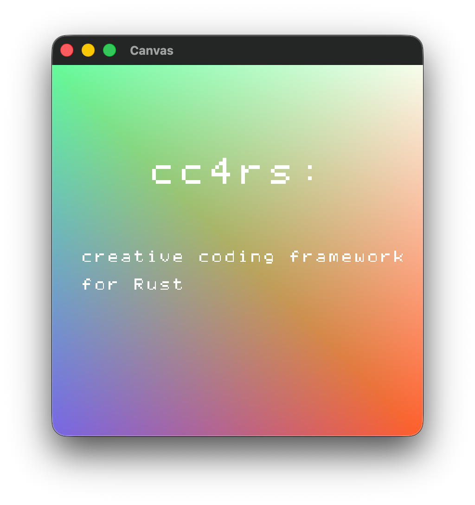

# cc4rs



Creative Coding framework in Rust language (using [Sokol framework](https://github.com/floooh/sokol-rust/))

Aiming to provide APIs like [openFrameworks](https://openframeworks.cc/documentation/) or [Processing](https://processing.org/reference) on top of [Sokol](https://github.com/floooh/sokol) framework ([sokol-rust](https://github.com/floooh/sokol-rust/)), with a little essence of [Ebitengine](https://ebitengine.org/).

> [!Warning]
> - Ported from [odin-cc](https://github.com/cc4v/odin-cc/), partially using GitHub Copilot (AI), so please use with care.
> - Current state is at **early stage** (APIs may change). Please consider to use [nannou](https://github.com/nannou-org/nannou) as an alternative at first.

## Comparison

When compared to [bevy](https://github.com/bevyengine/bevy) or [nannou](https://github.com/nannou-org/nannou) (which based on bevy), it's minimal, compact, short compilation time thanks to [Sokol framework](https://github.com/floooh/sokol-rust/).

If you need to extend this, you can use Sokol API on it.

## Examples

```bash
# for example:
cargo run --example logo_icon

# `cargo run --example` will show list of examples
```

## Use as crate

In your Cargo.toml:

```
cc4rs = { version="*", git="https://github.com/cc4v/cc4rs.git" }
sokol = { version="*", git="https://github.com/floooh/sokol-rust.git" }
```

(Maybe register to crate.io later, but just maybe.)

## License

- Files under `externals` are submodules to each other projects:
  - sokol-rust: https://github.com/floooh/sokol-rust/
- Files under `src` and  `examples`, see [LICENSE.md](LICENSE.md)
